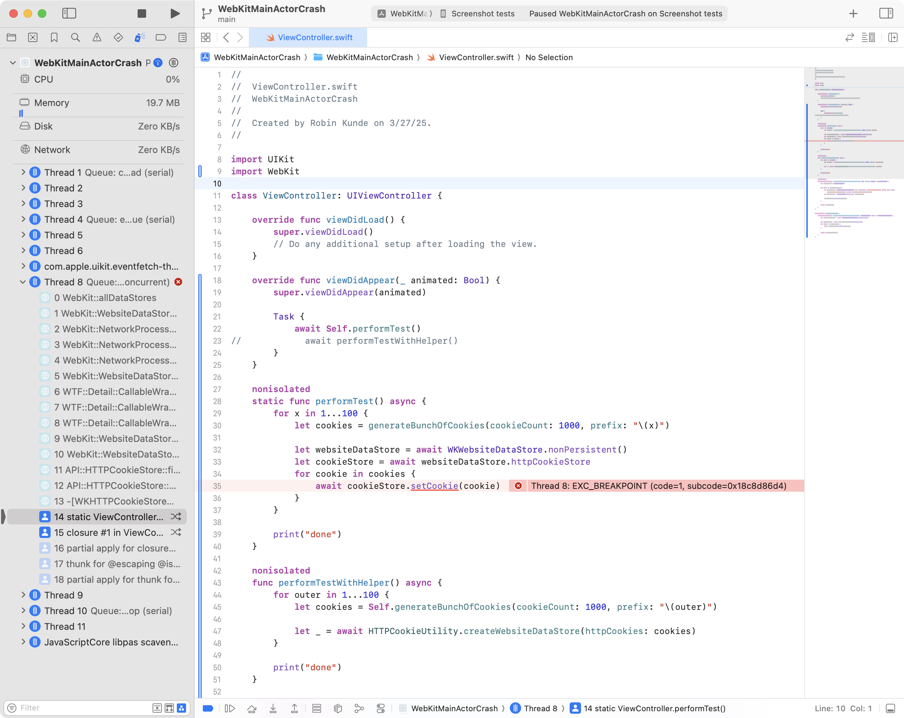

Even though `WKHTTPCookieStore` is annotated with `@MainActor`, `setCookie` will run on other threads, causing an [assertion](https://github.com/WebKit/WebKit/blob/9fddc271aaad0f6c65417976e2b93dae2ac3e752/Source/WebKit/UIProcess/WebsiteData/WebsiteDataStore.cpp#L123) to be triggered in WebKit.

